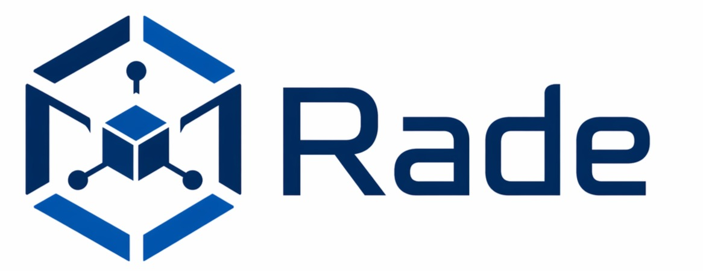

<p align="center">
  
</p>

# Rade

**Infrastructure for AI agents. Attach Rade to any project.**

[](https://www.npmjs.com/package/rade-cli)
[](LICENSE)
[](https://www.npmjs.com/package/rade-cli)

---

## Why Rade?

AI coding agents are powerful, but without shared conventions they produce inconsistent, hard-to-maintain code. Every new project reinvents the same guardrails from scratch.

**Rade solves this.** Define your skills and rules once in a central repo. Run `rade-cli attach` to generate the config files your agent tools expect. Standards stay versioned, auditable, and shared across your team.

## Features

- **Polyglot Skills** — YAML-based skill definitions with full agent instructions (tech detection, rule loading, response format).
- **Per-technology Rules** — Dedicated coding standards with frontmatter (`description` + `globs`) for each language.
- **Multi-tool Generation** — One source of truth generates configs for Cursor, Claude Code, Antigravity, and AGENTS.md.
- **Versioned & Auditable** — All rules live in Git. Review changes via PRs, track history, roll back.
- **Extensible** — Add a new technology in minutes: create a `.md` file with frontmatter, done.

## Quick Start

### Install globally

```bash
npm install -g rade-cli
```

### Attach to a project

```bash
cd my-project
rade-cli attach .
```

### Or run without installing

```bash
npx rade-cli attach .
```

### Target specific tools only

```bash
rade-cli attach . --tool cursor
rade-cli attach . --tool cursor,claude
rade-cli attach . --tool antigravity
```

Available tools: `cursor`, `claude`, `antigravity`, `agents-md` (default: all)

## Supported Tools

| Tool | Status |
|------|--------|
| [Cursor](https://cursor.sh) | ✅ Supported |
| [Claude Code](https://claude.ai/code) | ✅ Supported |
| [Antigravity](https://antigravity.dev) | ✅ Supported |
| AGENTS.md | ✅ Supported |
| [Windsurf](https://windsurf.run) | ⏳ Planned |

## Languages & Technologies Covered

| Language / Tech | Rule file | Globs |
|-----------------|-----------|-------|
| Go | [`go.md`](rules/go.md) | `*.go` |
| Bash | [`bash.md`](rules/bash.md) | `*.sh` |
| SQL | [`sql.md`](rules/sql.md) | `*.sql` |
| YAML | [`yaml.md`](rules/yaml.md) | `*.yaml, *.yml` |
| TypeScript / React | [`typescript-react.md`](rules/typescript-react.md) | `*.ts, *.tsx, *.jsx` |
| Frontend vanilla | [`frontend-vanilla.md`](rules/frontend-vanilla.md) | `*.html, *.js, *.css` |
| XML | [`xml.md`](rules/xml.md) | `*.xml` |

## CLI Commands

| Command | Description |
|---------|-------------|
| `rade-cli attach [path]` | Attach rade-cli to a project — generates all configs |
| `rade-cli sync` | Check for rule updates and apply them |
| `rade-cli check` | Show what has changed without modifying anything |
| `rade-cli update` | Pull latest rules and regenerate all configs |
| `rade-cli import <source>` | Import a rule from a URL, GitHub repo, or local file |
| `rade-cli list` | List all active rules (built-in, global, project) |
| `rade-cli remove <rule>` | Remove or exclude a rule |
| `rade-cli detach` | Remove rade-cli from the current project |

### What gets generated

| Tool | Output | Format |
|------|--------|--------|
| Cursor | `.cursor/rules/*.mdc` | One `.mdc` per rule (with globs) + one per skill (`alwaysApply: true`) |
| Claude Code | `CLAUDE.md` | Skill instructions + all rules bundled |
| Antigravity | `.agents/{rules,skills}/` | Native `.md` + `.yaml` files copied |
| AGENTS.md | `AGENTS.md` | Skill instructions + all rules bundled |

## Adding a New Technology

1. Create `rules/<technology>.md` with frontmatter:
   ```markdown
   ---
   description: "My Tech coding standards"
   globs: "*.ext"
   ---
   # My Tech Coding Standards
   - ...
   ```
2. Open a PR — see [CONTRIBUTING.md](CONTRIBUTING.md).
3. After merging, users get the new rule on the next `rade-cli sync`.

## Repository Structure

```
rade-cli/
├── README.md
├── LICENSE
├── CONTRIBUTING.md
├── CHANGELOG.md
├── ROADMAP.md
├── package.json
├── bin/
│   └── rade.js
├── src/
│   ├── index.js
│   ├── cli/                  # attach, sync, check, update, import, list, remove, detach
│   ├── core/                 # parser, generator, importer, syncer, backup, config
│   └── utils/                # fs, log, prompt, paths
├── skills/
│   ├── developer.yaml
│   └── tester.yaml
├── rules/
│   ├── 00-project-context.md.template
│   ├── go.md
│   ├── bash.md
│   ├── sql.md
│   ├── yaml.md
│   ├── typescript-react.md
│   ├── frontend-vanilla.md
│   └── xml.md
├── imports/
├── test/
└── docs/
    └── ARCHITECTURE.md
```

## Testing Locally

```bash
git clone https://github.com/your-org/rade-cli.git
cd rade-cli
npm install
npm link

cd ~/my-project
rade-cli attach .
```

## Contributing

We welcome contributions! See [CONTRIBUTING.md](CONTRIBUTING.md).

## License

[MIT](LICENSE)
